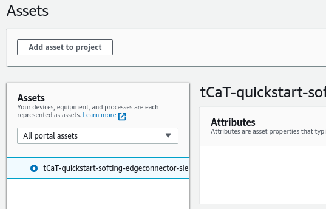

// Add steps as necessary for accessing the software, post-configuration, and testing. Don’t include full usage instructions for your software, but add links to your product documentation for that information.
//Should any sections not be applicable, remove them

//== Test the deployment
// If steps are required to test the deployment, add them here. If not, remove the heading

== Post-deployment steps
// If Post-deployment steps are required, add them here. If not, remove the heading

=== In CloudFormation

After the stack is created, see the following outputs:

* *SiteWiseAsset*: The name of the asset created for receiving the UA tag data from the {partner-product-short-name} UA endpoint.
* *UAEndpoint*: The URL to the internal UA server in the edgeConnector to which any UA client can connect, using the necessary authentication credentials.
* *edgeConnectorSiemens*: The URL to the local administration/configuration interface of {partner-product-short-name}.

=== In {partner-product-short-name}

NOTE: If the simulated connection that is preconfigured with {partner-product-short-name} fails, do the following steps to verify or recreate a connection. 

. Open the *edgeConnectorSiemens* URL in a new browser tab and enter your login credentials (admin, admin). +
[#{partner-product-short-name} login window]
[link=images/cf_edgeConnector_login.png]
image::../images/cf_edgeConnector_login.png[edgeConnectorLogin]

. On the *Connectivity* page, choose *PLC* > *Siemens S7 1200/1500* to see the preconfigured simulated connection. +
[#{partner-product-short-name} connectivity window]
[link=images/cf_edgeConnector_connectivity.png]
image::../images/cf_edgeConnector_connectivity.png[edgeConnectorConnectivity]

. In the *Connection Settings* tab, the default value of the *Connection Name* field is *S7-Sim*, but you can provide a new name, if needed. Leave the default values in the other fields. 

[#{partner-product-short-name} new connection]
[link=images/cf_edgeConnector_new_connection.png]
image::../images/cf_edgeConnector_new_connection.png[edgeConnectorNewConnection]

. In the *Advanced Settings* tab, select the *Simulation* check box at the bottom. Then return to the *Connection Settings* tab and choose *Save*.

[#{partner-product-short-name} connection simulation option]
[link=images/cf_edgeConnector_connection_simulation.png]
image::../images/cf_edgeConnector_connection_simulation.png[edgeConnectorSimulation]

You are now configured with a simulated connection, which AWS IoT SiteWise will start polling in a few seconds. +

[#{partner-product-short-name} simulated connection]
[link=images/cf_edgeConnector_simulated_connection.png]
image::../images/cf_edgeConnector_simulated_connection.png[edgeConnectorSimulatedConnection]

You can check whether the connection to the simulator is successful by going to the *Address Spaces* section and browsing the server. +

[#{partner-product-short-name} simulated address space]
[link=images/cf_edgeConnector_simulated_addressspace.png]
image::../images/cf_edgeConnector_simulated_addressspace.png[edgeConnectorAddressSpace]

NOTE: For more information about the simulator in {partner-product-short-name}, see the https://github.com/SoftingIndustrial/datafeed-edge-connector/blob/master/edgeconnector-siemens/README.md#simulation-mode[Simulation Mode] section in the {partner-company-name} documentation.

You can access the {partner-product-short-name} deployed in the stack from any machine with a typical UA client application, since it's publicly available.

. Finally, remove unwanted access to the server by navigating to the *Connectivity* > *OPC UA > *OPC UA Server Application Settings* > *OPC UA Server Endpoint Settings* page, and deleting the *Anonymous* user. Now, only UA clients with administrative credentials and AWS IoT SiteWise can access the server.
[#{partner-product-short-name} anonymous disabled]
[link=images/cf_edgeConnector_anonymous_disabled.png]
image::../images/cf_edgeConnector_anonymous_disabled.png[edgeConnectorAnonymousDisabled]

NOTE: To access the UA server in {partner-product-short-name}, all UA clients authenticate with a user name and password. 

=== In the AWS IoT SiteWise portal

. Add the asset created for the current stack to the project by choosing *Add asset to project*. +
[#add asset to project]
.Add asset to project
[link=images/cf_edgeConnector_add_asset_to_project.png]

NOTE: This step ensures that the data shows on the AWS IoT SiteWise portal dashboard.

. If the asset measurements aren't displayed in the dashboard, and an error message displays at the top of the window, you can perform a temporary workaround.  

[#dashboard with errors]
[link=images/cf_edgeConnector_dashboard_problem.png]
image::../images/cf_edgeConnector_dashboard_problem.png[dashboardProblem]

To workaround the issue: +

.. Navigate to the AWS IoT SiteWise dashboard.
.. Choose the *Edit* button in the upper right corner, and remove the current measurements.
.. Add the measurements listed on the right side of the window by dragging and arranging them as desired.
.. Save your changes.

Now, you can view the telemetry data from the simualtor on the dashboard.

[#dashboard with data]
[link=images/cf_edgeConnector_dashboard.png
image::../images/cf_edgeConnector_dashboard.png[dashboard]

//== Best practices for using {partner-product-name} on AWS
// Provide post-deployment best practices for using the technology on AWS, including considerations such as migrating data, backups, ensuring high performance, high availability, etc. Link to software documentation for detailed information.

//_Add any best practices for using the software._

//== Security
// Provide post-deployment best practices for using the technology on AWS, including considerations such as migrating data, backups, ensuring high performance, high availability, etc. Link to software documentation for detailed information.

//_Add any security-related information._

== Other useful information
//Provide any other information of interest to users, especially focusing on areas where AWS or cloud usage differs from on-premises usage.

//_Add any other details that will help the customer use the software on AWS._

* All users assigned to the AWS IoT SiteWise portal must be unassigned before deleting the stack.
* The unique stack name is used for prefixing most of the stack resources created by the template, which allows you to create more stacks from the same template without requiring any changes. Check AWS limits for different accounts and Regions used. For example, a maximum of five VPCs are allowed per account. 
* The stack creates only the minimum necessary resources to remain as cost-effective as possible. For example, it creates only one Amazon EC2 instance, even though the deployment sets up two Availability Zones. 
* Since the stack is used for demo purposes, load balancing and Auto Scaling group definitions are used only when the Amazon EC2 instance fails or an Availability Zone becomes unavailable. 
* If the Amazon EC2 instance is stopped/terminated either by the user manually, or for some other reason, the IP address of a newly created instance will be different. However, the load balancer will still be able to access the new Amazon EC2 instance after it has completed its bootstrapping process. This may take a few minutes (3-5 minutes), so try reloading the page several times to see when the new instance presents the login window again. 
* See the *UserData* section of the *EC2LaunchTemplate* resource in the workload.template.yaml file for additional actions that the template takes when bootstrapping the Amazon EC2 instance.
* AWS IoT SiteWise gateways are not deleted automatically. They require manual deletion. Multiple AWS IoT SiteWise gateway configurations don't interfere with each other. If an Amazon EC2 instance fails and another one is created by the Auto Scaling group, the original AWS IoT SiteWise gateway resource is lost, which means that the CloudFormation template can't delete it when the stack is deleted. To solve this issue, the Amazon EC2 *UserData* script creates it, but it needs to be deleted manually.