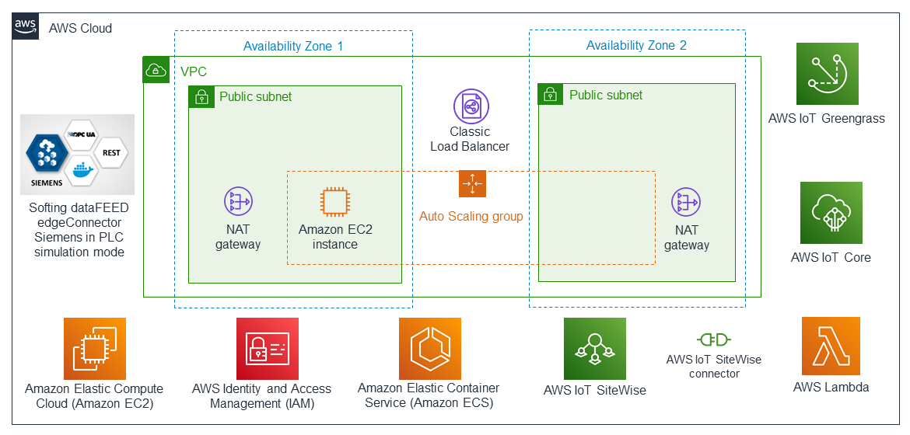

Deploying this Quick Start for a new virtual private cloud (VPC) builds the following {partner-product-name} environment in the AWS Cloud. +

// Replace this example diagram with your own. Send us your source PowerPoint file. Be sure to follow our guidelines here : http://(we should include these points on our contributors giude)
[#architecture]
.Quick Start architecture for {partner-product-name} on AWS
[link=images/softing-edgeconnector-siemens-architecture-diagram.png]

As shown in the architecture diagram, the Quick Start sets up the following:

* A highly available architecture that spans two Availability Zones.
* A virtual private cloud (VPC) configured with two public subnets, according to AWS best practices, to provide you with your own virtual network on AWS.
* An instance of {partner-product-short-name} in PLC simulation mode to provide a local, web-based administration user interface and an S7-1200/1500 protocol simulator and data generator.
* A Classic Load Balancer to route data traffic to {partner-product-name} over HTTP.
* In the public subnets:

** Managed network address translation (NAT) gateways to allow outbound internet access for resources.
** An Amazon Elastic Compute Cloud (Amazon EC2) instance in an Auto Scaling group to help ensure continuous availability.

* An Elastic Container Service (Amazon ECS) cluster with a task definition to deploy the edgeConnector Docker container to the Amazon EC2 instance.
* AWS Identity and Access Management (IAM) configurations that include groups, roles, and instance profiles as well as customizable IAM policies.
* AWS IoT SiteWise to start the data flow from {partner-product-name} to AWS IoT Core and AWS IoT SiteWise, including asset models, assets (which are hardcoded in the CloudFormation template for demo purposes), AWS IoT SiteWise gateway configuration to access the OPC UA server in {partner-product-short-name}, asset measurement mappings to the UA tags on the server, and the AWS IoT SiteWise portal, project, and dashboard for visualizing data.
* AWS IoT SiteWise Connector for connecting to the edge device.
* AWS IoT Greengrass and AWS IoT Core, both used for consuming data.
* A Lambda function for automating deployment tasks.